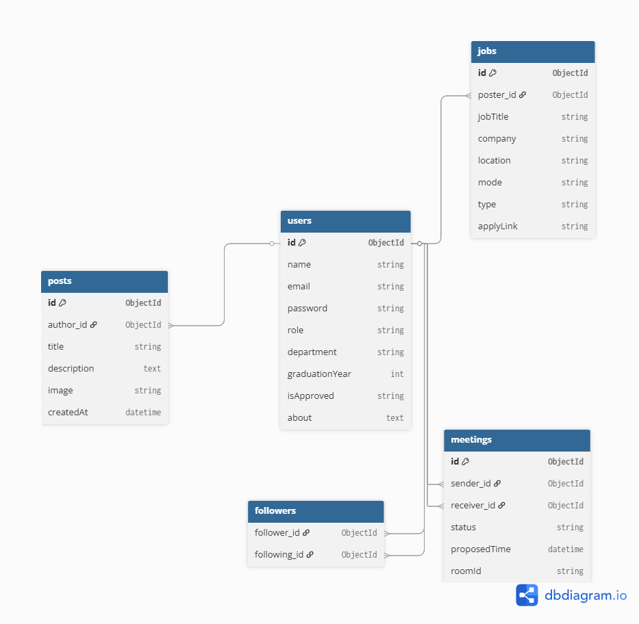

# ⚙️ Alumni Centralized System - Backend

<p align="center">
  
</p>

<p align="center">
  
  
  
  
  
</p>

---

The backend of the **Alumni Centralized System** is a robust, high-performance API engine designed to power the networking platform. It manages relationships, secure authentication, and real-time service integrations with ease.

## 🛡️ Core Responsibilities

- **🔐 Secure Auth:** Enterprise-grade security with JWT and Bcrypt hashing.
- **🗄️ Scalable Data:** Optimized MongoDB schemas for networking and careers.
- **🚀 Real-time Support:** Integrated services for instant meetings.
- **📜 Professional Logging:** Comprehensive request tracking with Morgan.

## 🛠️ Tech Stack

| Category | Technology |
| :--- | :--- |
| **Runtime** | Node.js (ES Modules) |
| **Framework** | Express.js 5 |
| **Database** | MongoDB (Mongoose) |
| **Security** | JWT, Bcryptjs, CORS |
| **Storage** | Multer |
| **DevOps** | Dotenv, Nodemon |

## 🚀 Getting Started

### Prerequisites
- **Node.js** (LTS version)
- **MongoDB** (Atlas or Local)

### Installation

1. **Clone & Enter**
   ```bash
   git clone https://github.com/parthsalankar3108/AlumniCentralizedSystemBackend
   cd AlumniCentralizedSystemBackend
   ```

2. **Install dependencies**
   ```bash
   npm install
   ```

3. **Configure Environment**
   Create a `.env` file in the root:
   ```env
   PORT=5000
   MONGODB_URI=your_mongodb_connection_string
   ```

4. **Ignite the Server**
   ```bash
   npm start
   ```

## 🛣️ API Architecture (Base Paths)

- `🚀 /auth` & `/user` - Identity and profile management.
- `💼 /jobs` - Career opportunity management.
- `📅 /meetings` - Virtual event scheduling logic.
- `📝 /posts` - Social feed and media orchestration.
- `📁 /uploads` - High-speed static file delivery.

## Important Resources
- `Frontend Repo` - https://github.com/dmelloarlen/AlumniCentralizedSystem
- `Video` - https://drive.google.com/file/d/13JG5RadVJdlm8HIo5khzCetHhLyi--fw/view?usp=drive_link
- `PPT` - https://drive.google.com/file/d/1Gx7s3zVzMM97uy0gCFN97seqhlbsdBxn/view?usp=drive_link
- `Report` - https://drive.google.com/file/d/16g2KScwUWZxSh-2YDAIsMBl0LOzYKX5p/view?usp=drive_link

